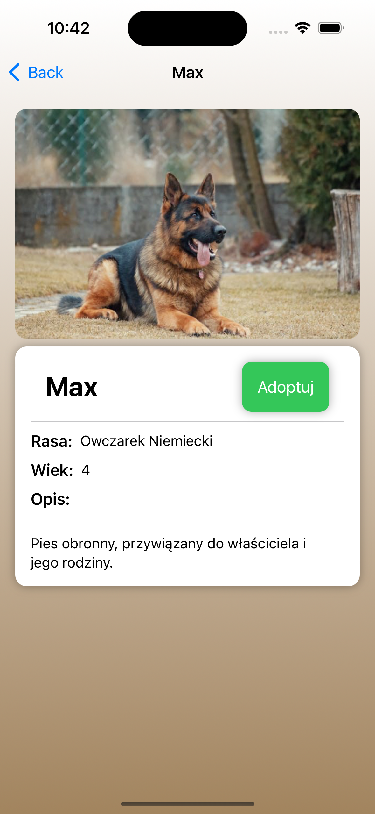

# Adoptuj zwierzaka

## Opis projektu

"Adoptuj zwierzaka" to aplikacja na urządzenia mobilne z systemem iOS, napisana w języku SwiftUI, która umożliwia adopcję zwierząt z lokalnych schronisk. Umożliwia użytkownikom przeglądanie, składanie wniosków adopcyjnych oraz śledzenie statusu swoich wniosków. Administratorzy mogą zarządzać wnioskami, zwierzętami i użytkownikami.

    
    
    
    
    
    

## Architektura i technologie

### Architektura

Aplikacja korzysta z architektury MVC (Model-View-Controller), co pozwala na wyraźne oddzielenie logiki biznesowej od interfejsu użytkownika.

### Technologie

- **SwiftUI**: Modern framework do budowy interfejsu użytkownika na platformy Apple.
- **CoreData**: Lokalne przechowywanie danych zapewniające trwałość i optymalizację operacji na danych.
- **Swift**: Główny język programowania.

### Kluczowe funkcje

- **Dynamiczne listy**: Listy zwierząt i wniosków są dynamicznie generowane z bazy danych.
- **Filtrowanie**: Użytkownicy mogą przeglądać zwierzęta na podstawie dwóch kryteriów (pies, kot).
- **Rejestracja i Logowanie**: Użytkownicy mogą zakładać konta i logować się za pomocą formularzy, które są walidowane po stronie klienta.
